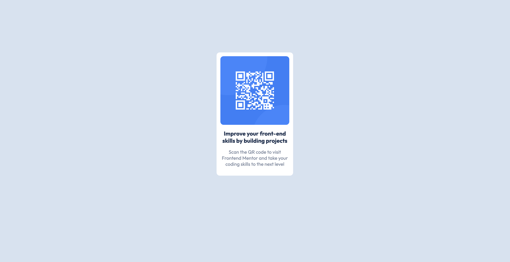

# Frontend Mentor - QR code component solution

This is a solution to the [QR code component challenge](https://www.frontendmentor.io/challenges/qr-code-component-iux_sIO_H) on Frontend Mentor.

## Table of contents

- [Overview](#overview)
  - [Screenshot](#screenshot)
  - [Links](#links)
  - [Built with](#built-with)
  - [What I learned](#what-i-learned)
  - [Continued development](#continued-development)
  - [Useful resources](#useful-resources)
- [Author](#author)
- [Acknowledgments](#acknowledgments)

## Overview

### Screenshot

### Links

- [Solution URL](https://github.com/EtFX1/Frontend-Mentor-challenge-QR-code-component)
- [Live Site URL](https://etfx1.github.io/Frontend-Mentor-challenge-QR-code-component/)

### Built with

- Semantic HTML5 markup
- CSS custom properties
- [Styled Components](style-guide.md) - For styles

### What I learned

I learned about how containers work in HTML and CSS, and their importance.
I also learned how to center a div, as well as text in that div. 
I learned about the "max-width" property as well, and how its usefulness in sizing elements. 

### Continued development

I am currently learning bootstrap 5, and I'd like to refine my skills using the framework. However I built this project with just some vanilla HTML and CSS. However in the future I might submit a solution on it using bootstrap, as well as on many other projects in the future. 

### Useful resources

- [Freecodecamp blog: Learn CSS Basics by Building a Card Component](https://www.freecodecamp.org/news/learn-css-basics-by-building-a-card-component/) - This is a beginner friendly, very well broken down blog post that really helped me understand how to build a simple card with just some HTML and CSS. It doesn't just explain how to build a card, but explains how HTML and CSS work in general. This is a great example of project based learning!
- [The Complete 2023 Web Development Bootcamp](https://www.udemy.com/course/the-complete-web-development-bootcamp/) - I'm only 16% through the course as of the day of posting this to github, but so far I've learned HTML, CSS and bootstrap. Dr.Angela Yu is an amazing teacher, and I'd recommend this course to anyone wanting to learn web development. She teaches the MERN stack (MongoDB,  Express.js, React.js and Node.js), and It's a great starting point for anyone wanting to learn Fullstack web development. 

## Author

- Frontend Mentor - [@EtFX1](https://www.frontendmentor.io/profile/EtFX1)
- GitHub - [@EtFX1](https://github.com/EtFX1)

## Acknowledgments

My acknowledgements go to the people who created the content mentioned in [Useful resources](#useful-resources)
